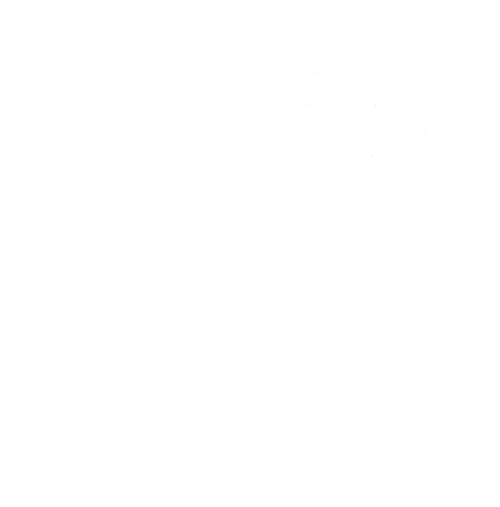
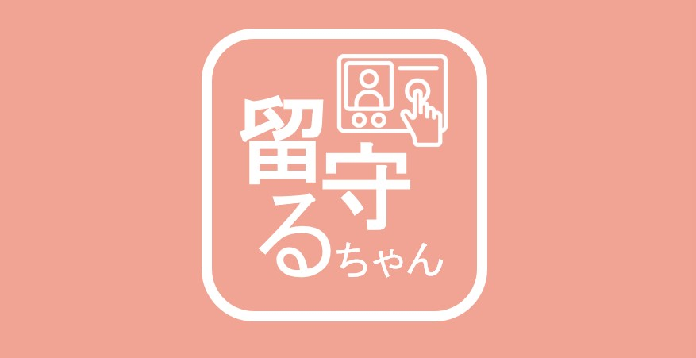

# 留守るちゃん 
(画像をクリックしてください。デモが流れます。)

## 製品概要
安心安全　×　Tech

### 背景(製品開発のきっかけ、課題等）

子どもが一人で留守番している時、インターフォンに子どもが勝手に応えてしまうと防犯面で心配…そんな不安を解消するシステムを作りたい！という思いから、大人の不在時にはインターフォンが自動で対応してくれる防犯システムを作りました。

### 製品説明（具体的な製品の説明）
- スタートページ
    - STARTをクリックするとインターフォンが表示されます
    
- 不審者
    - 訪ねてきた人で知り合いでないと判断した人の写真の一覧を見ることができます。
    
- 知人
    - 知り合いであると登録した人の写真の一覧を見ることができます。
    - 写真をクリックするとファイル名の後ろに氏名を入力することができるようになっています。
    

- カレンダー
    - 今日の日付を確認することができます。
    
- インターフォン
    - インターフォンのカメラの映像を利用して、尋ねてきた人の顔認証を行います。
    - 知人か不審者か判別し、判別内容によってインターフォンの操作内容を変えます。
  - 在宅か不在か状態を選択できるようにし、インターフォンの自動対応の仕方を変えています。
  
    
- 危険人物
    - 危険人物に登録した人の写真の一覧を見ることができます。
    - 不審者から危険人物に設定した人の外見の特徴を自動的にまとめます。
    

### 特長

#### 1. **不審者検知**
登録した画像から顔認識を行い、訪ねてきた人に不審者・知人の判定を行います。結果に応じて、知人か危険人物かの判定結果をインターフォンに表示します。
#### 2. **登録機能**
訪ねてきた未知の人物を、手動で知人または不審者として登録します。
#### 3. **履歴表示**
日付に基づいて、過去の訪問者の画像一覧を表示します。

### 実行時の注意
danger.pyではimage_folderのパス、target_danger_page.phpではpythonスクリプトのパスを自身の絶対パスに変更してください。
### 解決出来ること

「留守るちゃん」は子どもの留守番時に子供だけでインターフォンの対応をすることを避け、子どもの安全を守ります。また、訪ねてきた人の危険人物情報を特徴だけでなく写真とともに分かりやすく一覧としてみることができます。

### 今後の展望
現時点では、実行しているパソコンでしか危険人物を閲覧できないようになっている。今後は指定した人同士で危険人物一覧の共有ができるようにしたい。また、カレンダーのページで日付を選択すると訪問者を一覧で見ることができるようにしたい。

### 注力したこと（こだわり等）
- インターフォンの自動対応を在宅時と不在時で変えたこと

- 在宅時に知人が訪ねてきた場合、一定時間対応をしないと訪問者に対して少し待つような音声が流れるようになっていること。

- 不在時に人が訪ねてきた場合、留守にしていることを伝える音声を流すようにしたこと

- 人が訪ねてきた際にその場で知人か危険人物かを選択できるようになっていること。

## 開発技術

### 活用した技術

#### API・データ

- Flask
- MAMP
- Google Cloud Vision
- 
- 
- Flask-CORS
- 

- HTML / CSS / JavaScript：フロントエンドの構築

- 音声 byボイスゲート（https://vidweb.co.jp/voicegate/ ）

#### デバイス

- パソコン

- iPhone

### 独自技術

#### ハッカソンで開発した独自機能・技術
- 登録した顔写真から知人か不審者かを判定する機能

- 在宅時に一定時間応答しなかった場合に訪問者に対して少し待ってもらうような音声を流す機能

- 不在時に留守にしていることを伝える音声を流す機能

- 危険人物の特徴を画像から自動的に文書にする機能
